# Semana 3 — Backend, base de datos y APIs iniciales

## 1. Repositorio y estructura

PredictIA Industrial cuenta con un repositorio Git/GitHub inicializado, cuya rama principal es `main`.

La estructura implementada es:

```text
backend/
database/
docs/
frontend/
```

La carpeta `frontend/` permanece reservada. React todavía no fue implementado.

## 2. Backend

El backend fue inicializado con Node.js y Express.

| Elemento | Estado |
| --- | --- |
| Node.js | `v22.19.0` |
| npm | `10.9.3` |
| Framework | Express |
| Dependencias principales | CORS, dotenv, mysql2 |
| Arquitectura | Configuración, rutas, controladores, servicios y repositorios |
| Middleware | 404 y manejo general de errores |

## 3. MySQL

El motor utilizado por PredictIA Industrial es **MySQL Community Server `8.4.11`**, configurado en el puerto `3307`, con la base `predictia_industrial`.

El puerto `3307` fue utilizado para evitar el conflicto con una instalación previa de MariaDB que ocupaba el puerto `3306`. MariaDB no es el motor del proyecto.

## 4. Base de datos

Se publicaron los siguientes scripts:

- `database/01_schema.sql`
- `database/02_seed.sql`
- `database/03_integrity_tests.sql`

El esquema contiene exactamente 11 tablas:

1. `roles`
2. `usuarios`
3. `maquinas`
4. `variables_monitoreadas`
5. `asignaciones_maquinas`
6. `limites_configurados`
7. `mediciones`
8. `alertas`
9. `historial_estados_alertas`
10. `atenciones_alertas`
11. `observaciones_maquinas`

Se comprobaron 17 relaciones mediante claves foráneas.

## 5. Datos iniciales

El seed cargó exactamente:

- 3 roles: `administrador`, `mantenimiento` y `operario`.
- 2 variables monitoreadas: `temperatura` y `vibracion`.

Las unidades son:

| Variable | Unidad | Codificación comprobada |
| --- | --- | --- |
| `temperatura` | `°C` | `C2B043` |
| `vibracion` | `mm/s` | `6D6D2F73` |

El seed es idempotente y no se cargaron máquinas ficticias.

## 6. Integridad

`database/03_integrity_tests.sql` comprobó intencionalmente las siguientes restricciones:

| Prueba | Resultado esperado |
| --- | --- |
| Rol duplicado | Error `1062` |
| Referencia a máquina inexistente | Error `1452` |
| Límite negativo | Error `3819` |
| Límite duplicado | Error `1062` |
| Alerta duplicada | Error `1062` |
| Estado inválido | Error `3819` |
| Cambio hacia el mismo estado | Error `3819` |
| Eliminación restringida de máquina relacionada | Error `1451` |

Al finalizar las pruebas se ejecutó `ROLLBACK` y se comprobó que:

- `maquinas_prueba_restantes = 0`
- `usuarios_prueba_restantes = 0`

## 7. Conexión Node.js–MySQL

La conexión utiliza el usuario de aplicación `predictia_app@127.0.0.1`, con permisos `SELECT`, `INSERT` y `UPDATE` sobre `predictia_industrial.*`.

La contraseña no se incluye en esta documentación. El backend utiliza un pool mediante `mysql2/promise` y verifica la conexión con MySQL antes de iniciar.

También se realizó una prueba controlada deteniendo `MySQL84`; el backend rechazó correctamente el inicio ante la imposibilidad de conectar.

## 8. APIs implementadas

Durante la Semana 3 se implementaron las siguientes APIs de lectura y health:

| Método | Ruta | Resultado comprobado |
| --- | --- | --- |
| `GET` | `/api/health` | Health del backend correcto |
| `GET` | `/api/health/database` | Health de la conexión MySQL correcto |
| `GET` | `/api/roles` | `count: 3` |
| `GET` | `/api/variables` | `count: 2` |
| `GET` | `/api/maquinas` | `count: 0` y `data: []` |

La ausencia de máquinas en `/api/maquinas` es intencional, porque no existen máquinas iniciales.

Una ruta inexistente devuelve una respuesta controlada HTTP `404` mediante el middleware correspondiente.

Estas APIs iniciales permanecen públicas durante la Semana 3. JWT, autenticación, autorización y CRUD completo no fueron implementados porque corresponden a etapas posteriores.

## 9. Commits relevantes

| Commit | Descripción |
| --- | --- |
| `0258f46` | `chore: inicializar estructura del proyecto` |
| `b2aa88f` | `feat: inicializar backend con Node.js y Express` |
| `78d25fa` | `feat: implementar esquema y datos iniciales de MySQL` |
| `1ac5e2f` | `feat: conectar backend con MySQL` |
| `e6d0789` | `feat: agregar APIs de roles y variables` |
| `0852c11` | `feat: agregar API inicial de maquinas` |

## Evidencias visuales

### 1. Repositorio GitHub

Demuestra el repositorio del proyecto en GitHub.

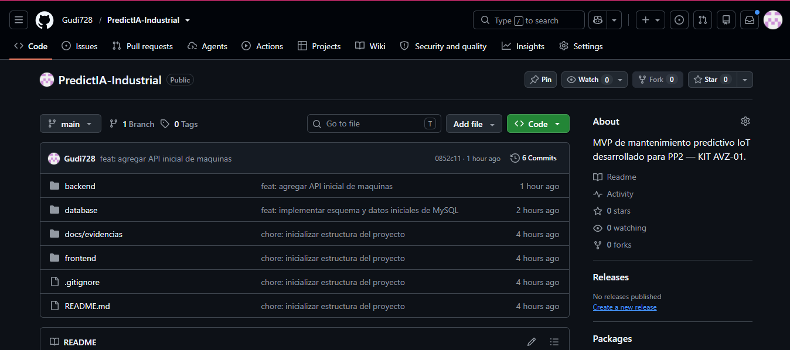

### 2. Health del backend

Demuestra la respuesta correcta del endpoint de health del backend.

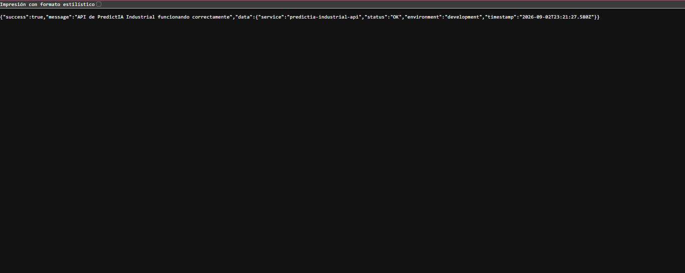

### 3. Versión y puerto MySQL

Demuestra la versión de MySQL y el puerto utilizado por el proyecto.

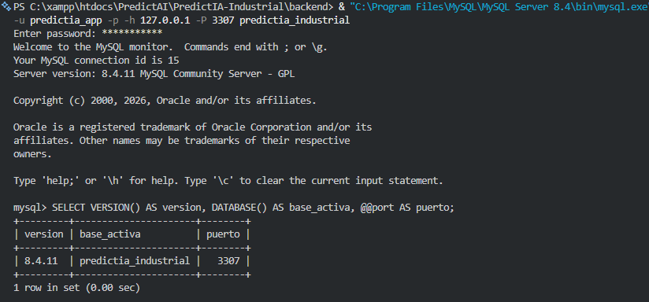

### 4. Once tablas creadas

Demuestra la creación de las 11 tablas del esquema.

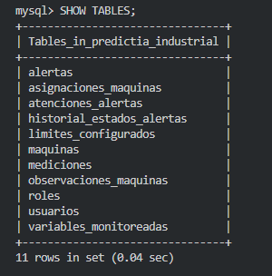

### 5. Diecisiete relaciones foráneas

Demuestra las 17 relaciones mediante claves foráneas.

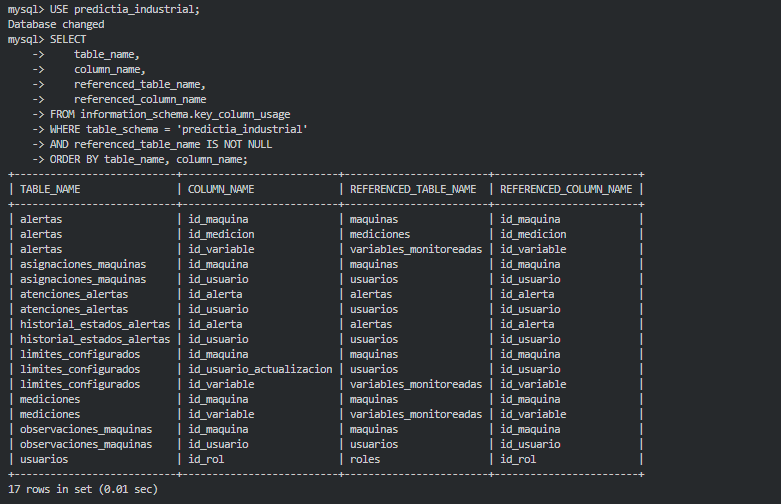

### 6. Datos iniciales

Demuestra la carga de los roles y variables iniciales.

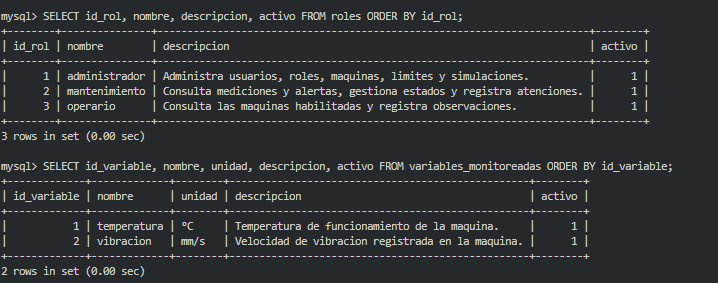

### 7. Codificación de unidades

Demuestra la codificación comprobada de `°C` y `mm/s`.

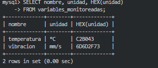

### 8. Pruebas de integridad y rollback

Demuestra las pruebas de restricciones y la reversión de los datos temporales.

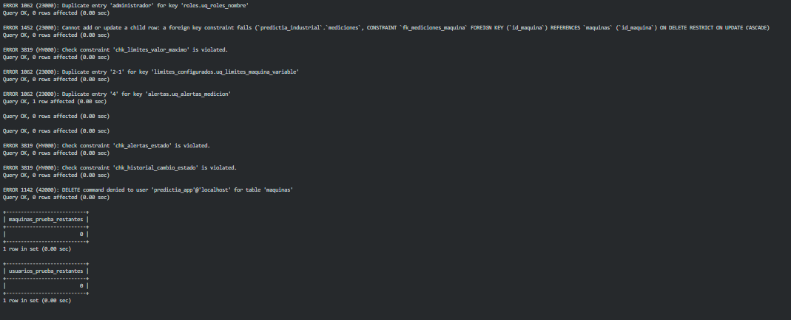

### 9. Health de base de datos

Demuestra la respuesta del endpoint de health de la conexión con MySQL.

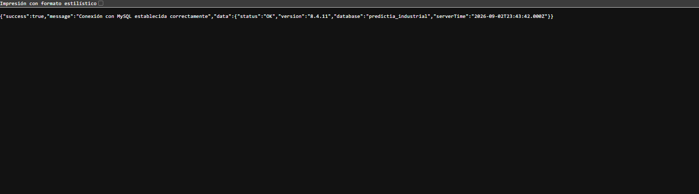

### 10. API de roles

Demuestra que la API de roles devolvió `count: 3`.

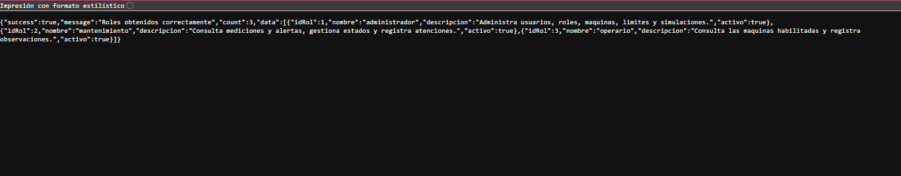

### 11. API de variables

Demuestra que la API de variables devolvió `count: 2`.

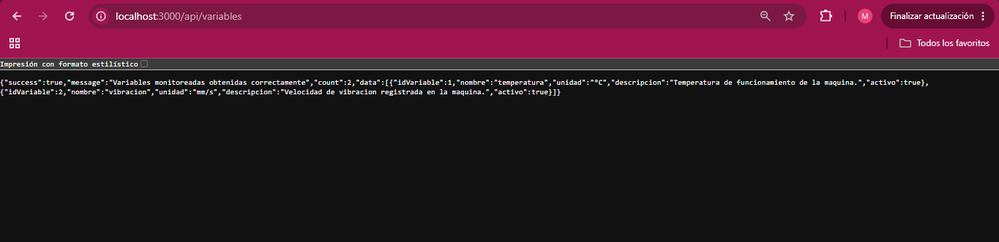

### 12. API de máquinas

Demuestra que la API de máquinas devolvió `count: 0` y `data: []`.

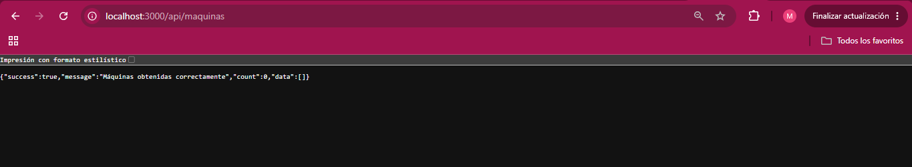

### 13. Ruta inexistente

Demuestra la respuesta controlada HTTP `404` para una ruta inexistente.

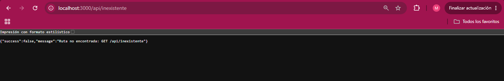

### 14. Historial de commits

Demuestra el historial de commits relevantes del proyecto.

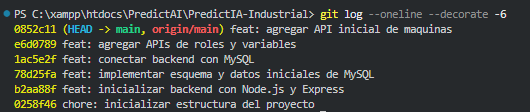

### 15. Estado final de Git

Demuestra el estado final del repositorio Git.

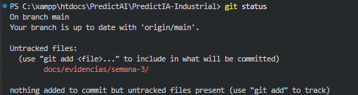

## Uso de inteligencia artificial

Se utilizó inteligencia artificial como asistencia para:

- planificación de pasos;
- generación y revisión de código;
- preparación de consultas SQL;
- análisis de errores;
- preparación de pruebas;
- documentación.

Las operaciones fueron ejecutadas y verificadas localmente. Las evidencias corresponden a resultados reales del proyecto.

## Estado final

**Semana 3 — IMPLEMENTADA, PROBADA Y DOCUMENTADA**

La Semana 4 todavía no fue iniciada.
